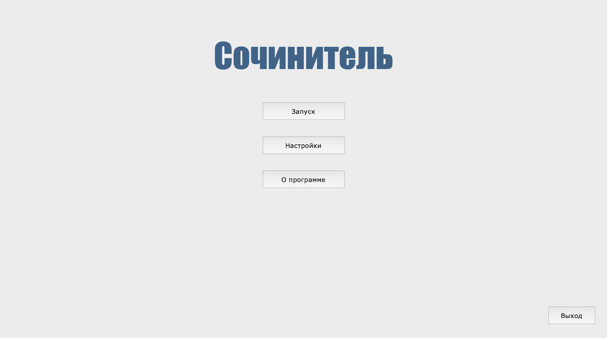
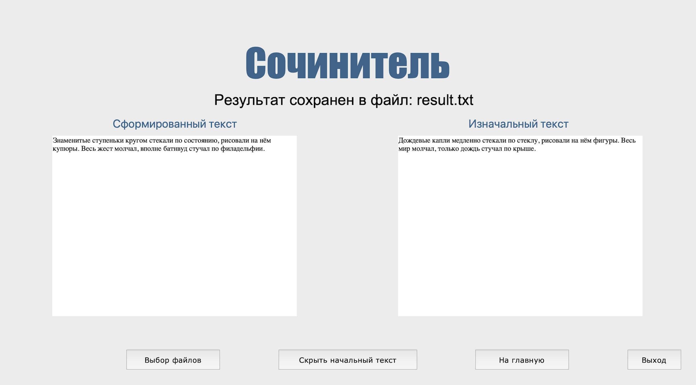

## Программа "сочинитель" текста

*Read this in other languages: [English](README.md), [Русский](README.ru.md).*

<b> [Main](./Main.py): </b> - графический интерфейс для демонстрации работы и использование основных алгоритмов
и функций.  
<b> [TheWriter](./TheWriter.py): </b> - файл с реализацией основных алгоритмов  

### О программе:
Программа - "сочинитель" текста заданного вида. Изменяется заданный текст по определенным правилам:
1) Из текста выбираются фразы, соответствующие заданному виду, стилю (длина, части речи, длина слов и т.п.).
2) В каждой фразе несколько слов заменяются на более подходящие (формально, по стилю, например, на более длинные).
3) Слова берутся из неиспользованных фраз текста, ставятся в нужной форме.
4) Четко выполняется соответствие по морфологическим характеристикам (понятно, что семантически может
быть бессмыслица, но грамматически текст верный). 
Пример: "Петя рисует дом" - "Интеграл усиливает простуду". 
Графический интерфейс сделан с адаптацией под разный размер окна и разрешение экрана.
  

### Установка:
Используемые библиотеки: 
- pymorphy2
- math
- os
- tkinter
Не встроенной библиотекой является только pymorphy2. Если она не установлена, то можно ее установить
следующей командой: `pip install pymorphy2`
Если pip не установлен, то можно поставить в ручную: https://pypi.org/project/pip 
  

### Запуск:
Запуск осуществляется через: `python Main.py`  
Во время работы программы требуется два текстовых файла - шаблон текста для изменения и текст для словаря слов. 
Для удобства тестовые варианты текстов расположены в папке `/tests`  
Пример шаблона текста для изменения: `tests/text_template_to_change.txt`
Примеры текстов для словаря слов: 
`tests/text_for_dictionary_words.txt` - отрывок из книги Теодора Драйзера "Финансист". 
`tests/text_for_dictionary_words_2.txt` - стихотворение Михаила Лермонтова "Родина". 
Результат печатается на экране, а также формируется в виде текстового файла `result.txt`, расположенного
в корне, рядом с Main.py и др.  

### Настройки:
В данном проекте в разделе `Настройки` можно выбирать параметры работы "сочинителя" текста. 
Например, можно выбирать какие части речи рассматривать для изменения. Вид замены: гибкая, строгая и
нужно ли запоминать соответствия.  
А также можно настраивать выбор по длине слов (проверять равенство, не проверять и заменять большим).
