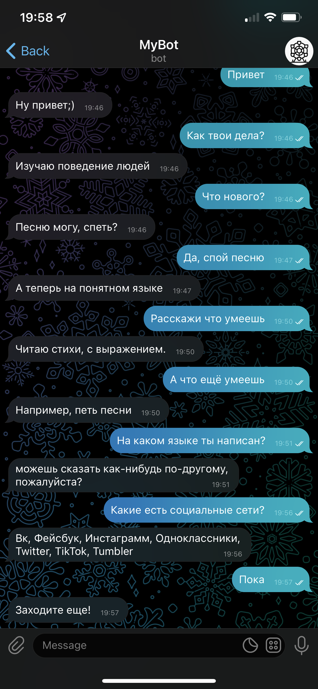

## Chatbot analogue of "Eliza"

*Read this in other languages: [English](README.md), [Русский](README.ru.md).*

Launch:
```bash
python3 bot-code.py
```

### Installation:
Libraries used:
- sklearn
- nltk
- telegram.ext

### Working with program:
During operation, the program prints a line-by-line dialogue of the bot with any user.<br>
With these settings for the created Token, communication takes place with the bot: @entertainment_gee_bot 

### About the program:
The program is a chatbot analog of "Eliza", built to simulate a conversation. The bot is built on a logistic
regression model and trained on fairly large sets of user dialogues. The bot responds perfectly to greetings
and goodbyes, responds well and with variety if the question is unclear to him and builds and comes up with
his own answers to questions. Also, from the training sample, the bot memorized a certain set of standard
questions and the corresponding answers to them.<br>

<b>Demonstration of the work:</b>



### Structure:
`bot-code.py` - the main file with chatbot implementation
`somewhere.py` - specifying bot launch parameters: bot token and proxy_url if necessary
`botconfig.py` - file with training sample 'intents' and 'test'
`dialogues.txt` - file for learning how to build a dialog with a user
